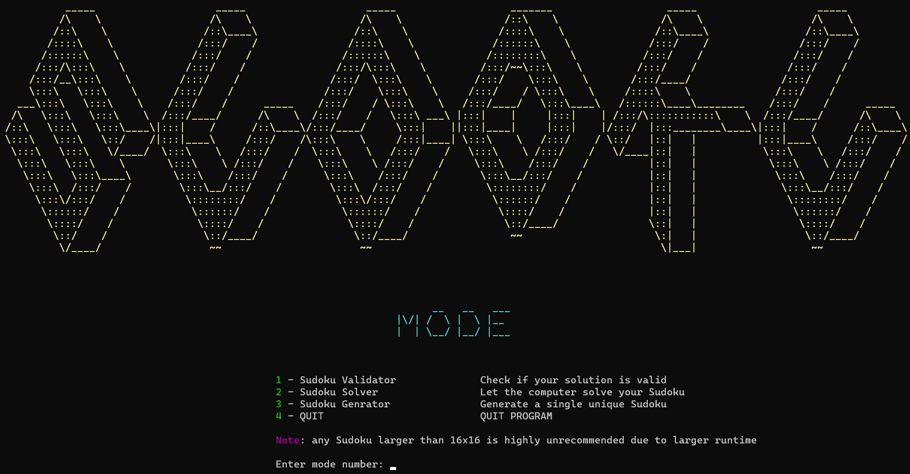
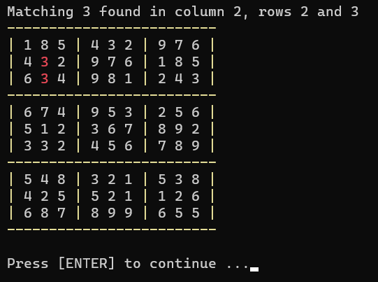
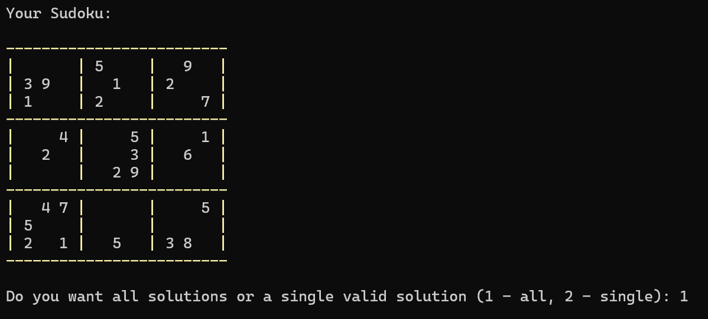
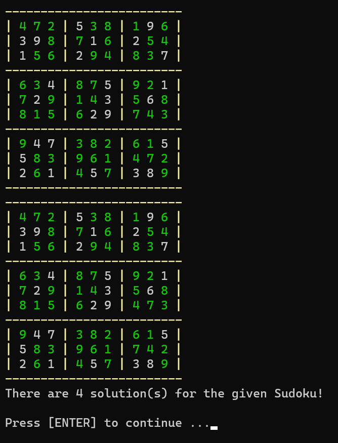
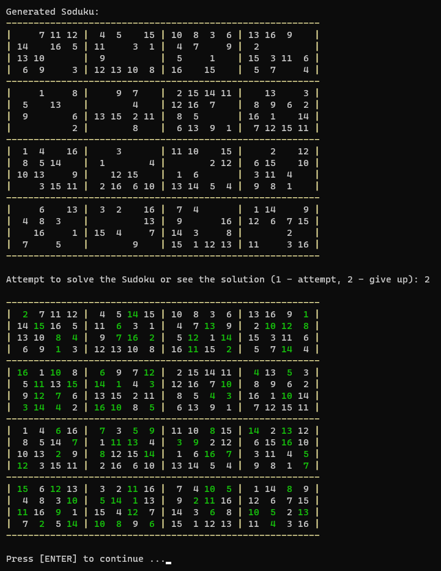

# Sudoku

This dynamic program offers three different services for different sized Sudokus.

### 1. Validator
    
The Validator takes in a Sudoku grid and outputs if the user's solution is valid or invalid. A Sudoku is valid if and only if all integers in each row, column, and
sub-square is unique and in range. If the solution is invalid, the program highlights the first matching cells found in red. If the grid is fully filled in and valid, 
the programs outputs that the user's grid is a valid solution. If the grid is only partially filled, and has potential to be a valid Sudoku, the program will output this.

    
### 2. Solver

The Solver takes in a Sudoku grid and outputs all valid solutions, or a single valid solution, depending on what the user wants. The more clues
the user gives, the faster the runtime. For instance, for a 9x9, it will take more time to solve a Sudoku that has 17 clues, compared to one that
has 30 clues.

The Solver can output a single solution for any Sudoku smaller than a 16x16 in a matter of seconds. The empty cells of the original Sudoku will be highlighted in green for clarity.

     
     
### 3. Generator

The Generator asks for the dimensions of a Sudoku (equal to the maximum value allowed in a cell), and randomly generates a Sudoku grid with a single
valid solution. The user can then attempt to solve the Sudoku, or give up and see the solution. Similar to the Sudoku Solver, the empty cells that are solved will
be highlighted in green.

**Note**: It is not recommended to use the Solver or Generator for Sudokus larger than 16x16, since a simple back-tracking algorithm is used. A faster algorithm would be Donald Knuth's [Dancing Links](https://en.wikipedia.org/wiki/Dancing_Links) technique.
